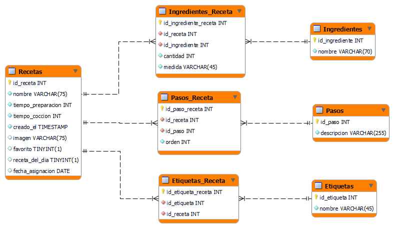
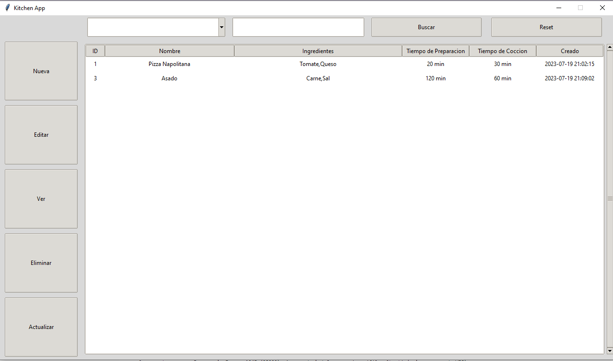
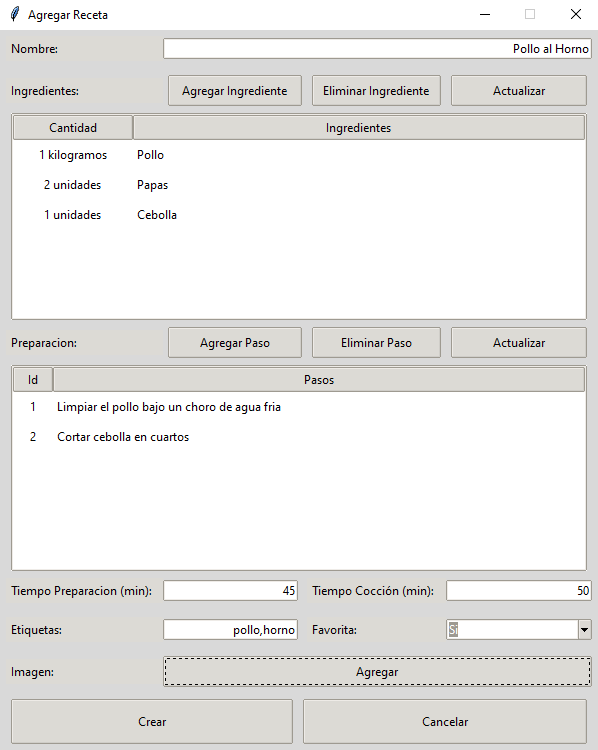
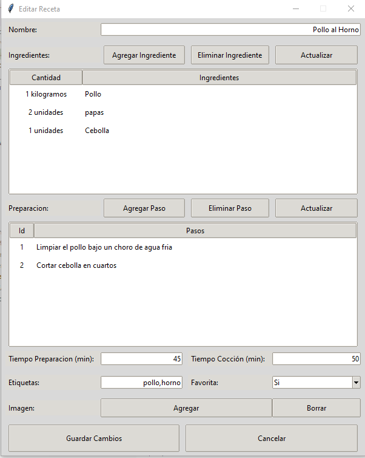

<p align="center">
 </a>
</p>
<h3 align="center">Recetario de Cocina</h3>

---

<p align="center"> Resolucion del Proyecto Integrador Final de la Catedra Programación 1 de la Carrera de Desarrollo de Software de la Universidad Provincial de Administración, Tecnologia y Oficios (UPATECO). Consiste en una aplicacion de escritorio donde puede almacenarse recetas de cocina. 
En un principio se administraba a traves de CSV pero se migro a una base de datos MYSQL durante el cursado de Programacion 2. 
<br> 

</p>

---

## 📝 Tabla de Contenidos
- [Consigna](#problem_statement)
- [Resolucion](#idea)
- [Instalación/Ejecucion](#getting_started)
- [Demo](#demo)
- [Vista Previa](#usage)
- [Tecnologias](#tech_stack)
- [Autor](#authors)


## 🧐 Consigna <a name = "problem_statement"></a>

Para este proyecto se deberá diseñar una aplicación de escritorio en la que puedan crear, editar y eliminar recetas.

Todos los incisos que tienen el símbolo '✅' son obligatorios, mientras que aquellos que tienen el símbolo '⭐' son opcionales.

Una receta debe estar compuesta de los siguientes datos:

    - Nombre. ✅
    - Una lista de los ingredientes. ✅
    - Preparación, lista ordenada de pasos a seguir. ✅
    - Imagen/es del plato preparado. Una receta puede o no tener una imagen. ✅
    - Tiempo de preparación (en minutos). ✅
    - Tiempo de cocción (en minutos). ✅
    - Fecha de creación. La fecha y hora en que se creó la receta en la aplicación. ✅
    - Etiquetas: palabras clave. ⭐
    - Es favorita (o no). ⭐

Un ingrediente debe contar con la siguiente información:

    - Nombre. ✅
    - Unidad de medida. ✅
    - Cantidad. ✅

Las funcionalidades que debe tener la aplicación son las siguientes:

    - Crear una receta. ✅
    - Modificar una receta. ✅
    - Eliminar una receta. ✅
    - Mostrar “receta del día” aleatoria en la ventana principal. ⭐
    - Buscar y/o filtrar recetas:
        ¬ Nombre. ⭐
        ¬ Por etiquetas. ⭐
        ¬ Tiempo de preparación. ⭐
        ¬ Ingredientes. ⭐

Debe contar con las siguientes vistas:

    - Recetario. Ventana principal por defecto.
    - Se muestra un listado de todas las recetas. ✅
    - Se mostrará como primera receta de lista a la “receta del día”, la cual debe tener un formato distinto a las demás recetas. ⭐
    - Muestra una receta ya existente. ✅
    - Carga/modificación de una receta. ✅
    - Búsqueda y filtro. La ventana deberá tener un campo de búsqueda, por nombre y/o etiqueta. Una vez filtrados las recetas, se las mostrará en una lista.⭐


## 💡 Resolucion <a name = "idea"></a>

DER:



Estructura del proyecto:

    .
    ├── images                          # Imagenes usadas en el proyecto
    │   ├── empty_star.png                  # Iconos de favorito
    │   └── star.png                        # Iconos de favorito
    ├── src                                 # Modulos/Clases Auxiliares
    |   ├── windows                         # Ventanas
    │   │   ├── AddIngredient.py                # Ventana que agrega ingrediente
    │   │   ├── AddMethod.py                    # Ventana que agrega paso
    │   │   ├── EditRecipe.py                   # Ventana editar receta
    │   │   ├── NewRecipe.py                    # Ventana crear receta
    │   │   ├── ReadRecipe.py                   # Ventana leer receta
    │   │   └── IBaseWindow.py                  # Base de las ventanas
    │   └── utils                           # Controlador de la BD
    │       ├── db_config.py                    # Credenciales 
    │       ├── db_migrate.py                   # Migracion 
    │       └── db_utils.py                     # Controlador
    ├── screenshots                         # App screenshots 
    ├── .gitignore                            
    ├── main.py                         # Ventana principal
    ├── constant.py                     # Enrutador
    ├── requirements.txt                # Dependencias
    └── README.md

## 🏁 Instalación/Ejecución <a name = "getting_started"></a>

Crear entorno virtual

```bash
python -m venv env
```

Activar entorno

```bash
source env/Scripts/activate
```

Clonar el repositorio

```bash
git clone git@github.com:Mettralla/recetario_cocina_app.git
```

Ir al directorio del proyecto

```bash
cd recetario_cocina_app
```

Instalar dependencias

```bash
pip install -r requirements.txt
```

Ingresar credenciales de MYSQL

```bash
# src/utils/db_config.py
DB_CONFIG = {
    'host': 'localhost',
    'user': 'user',
    'password': 'password',
    'database': 'recipe_manager'
}
```

Migrar la base de datos
```bash
python src/utils/db_migrate.py
```

Iniciar programa

```bash
python main.py
```

## 🎞 Demo <a name="demo"></a>

[Haz clic aquí para ver el video](https://youtu.be/a5Uhj2D3Kw4)

## 🎈 Vista Previa <a name="usage"></a>


- Ventana Principal


<br>

- Ventana Agregar Receta
<br>



- Ventana Editar Receta
<br>



- Ventana Ver Receta
<br>


## ⛏️ Tecnologias <a name = "tech_stack"></a>

- [Python 3.10.0](https://www.python.org) - Lenguaje
- Librerias usadas:
    - [Tkinter](https://docs.python.org/es/3/library/tkinter.html) - Interface de Python para Tcl/Tk
    - MySQL

## ✍️ Autor <a name = "authors"></a>
- Daniel Tejerina ([@mettralla](https://github.com/mettralla)) - [Linkedin](https://www.linkedin.com/in/daniel-alejandro-tejerina/)